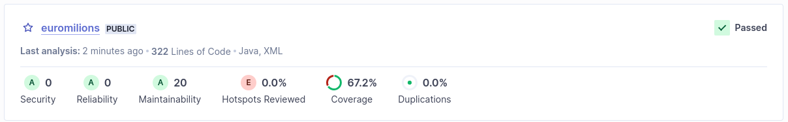

# Asnwer to lab6_1 e question

## Has your project passed the defined quality gate?

This is the report given by sonarqube after running the analysis on the project.

With this report we can see that the project has passed the quality gate. The quality gate is a set of conditions that the project must meet in order to be considered a quality project.

The conditions are:

- Security
- Reliability
- Maintainability
- Coverage
- Duplications

The analysis to the project said that the project has:

- Security: 0 issues, indicating there are no detected security vulnerabilities.
- Reliability: 0 issues, suggesting no major bugs were found that could affect the operation of the application.
- Maintainability: 20 issues, which might indicate code smells or technical debt but hasn't failed the quality gate for this category.
- Coverage: 67.2%, which means a good percentage of the code is covered by tests, although there's room for improvement.
- Duplications: 0%, indicating no significant blocks of code duplication were detected.

The project has passed the quality gate, but there are some issues that need to be addressed in the future. The project is in a good state, but there's always room for improvement.
