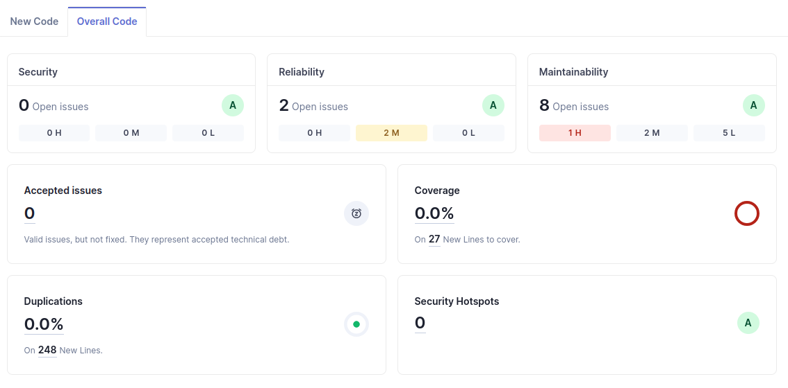
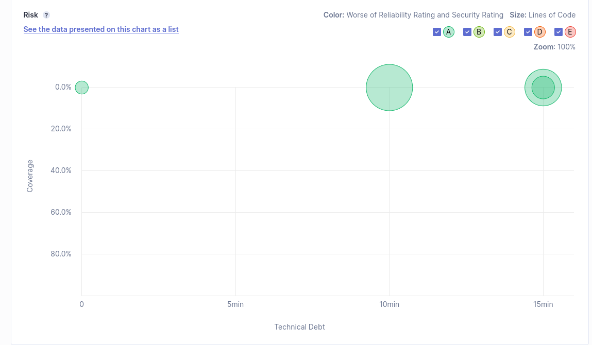
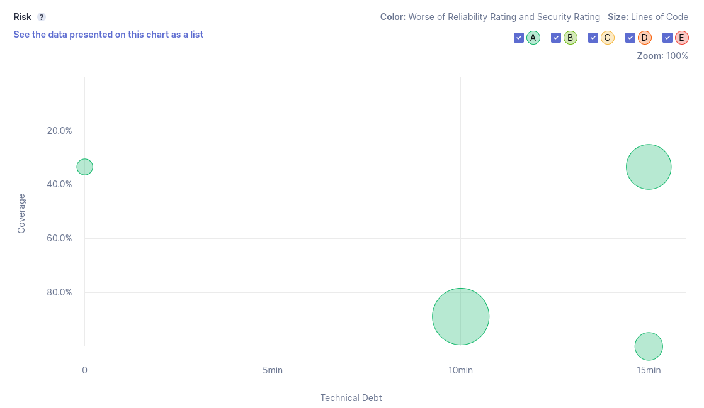

# Lab 6.2: SonarQube Analysis

## Asnwer to lab6_2 a. question

This is the report given by sonarqube after running the analysis on the project.

This is the technical debt report given by sonarqube after running the analysis on the project.

The scatter plot from the SonarQube analysis shows various points that represent different components or sections of the codebase, with the x-axis indicating the amount of technical debt and the y-axis indicating test coverage. Technical debt is quantified in terms of time, suggesting how long it would take to address the maintainability issues found in each component. For instance, a point lying on the 5-minute mark on the x-axis would suggest it is estimated to take 5 minutes to remediate the technical issues in that specific section of code.

In this chart, we see points spread out primarily between 0 to around 15 minutes of technical debt, with varying degrees of test coverage from 0% to just over 20%. This spread implies that while some parts of the codebase might require relatively little work to improve, others might need a more significant investment of time to bring up to the quality standards. Notably, the sizeable circles towards the right, which symbolize more substantial segments of code, indicate areas where a more considerable amount of work is required, which could potentially be riskier or more problematic due to the larger impact on the overall project. This visualization serves as a crucial tool for prioritizing refactoring efforts and addressing areas of the code that could benefit most from improvements in maintainability.

## Asnwer to lab6_2 b. question

Currently, there are 32 lines not covered by tests, which indicates there are segments of logic that could harbor undetected issues. More critically, the report highlights two conditions that have not been exercised during testing. These untested conditions obviously represent potential risks. With an overall coverage of 68%, there's room for improvement, particularly in condition coverage, which stands at 0%. Normally to affirm confidence in our code's reliability and maintainability, we should ideally be aiming for above 80% or even higher percentage of test coverage.